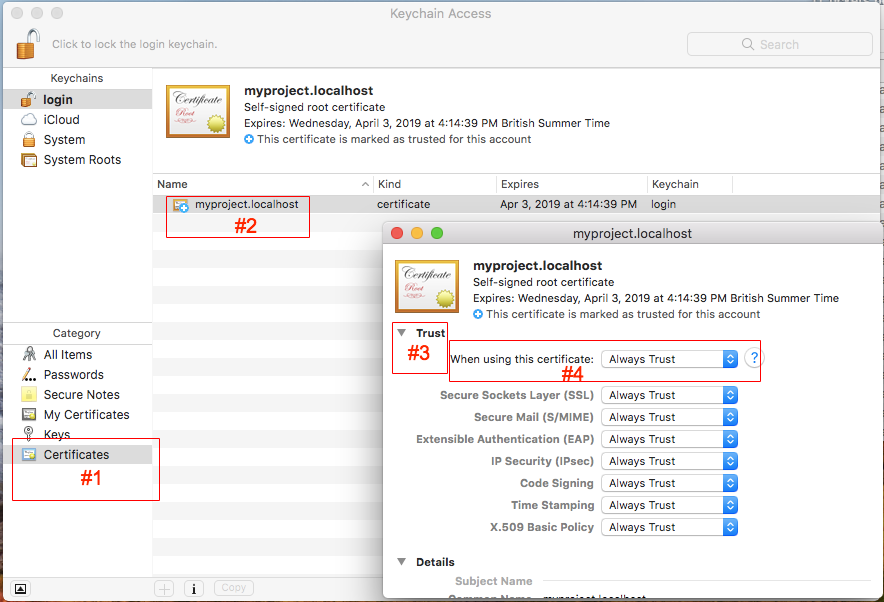
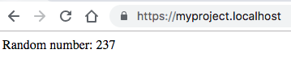

# Self-signed SSL Certificates

This tool generates self-signed SSL certificates which can be used for local development environments. You can easily cover any local subdomains with this certificate.

We suggest using `*.localhost` domains for local development. As they are resolved to your local machine by default and don't require any additional records in local `hosts` file.

## Requirements

1. You need to have installed [OpenSSL](https://github.com/openssl/openssl) to be able to generate self-signed SSL certificates. 

## Usage

Basic usage is straightforward and you need to follow 3 simple steps.

### 1. Generate self-signed certificate

Lets say you are working on `myproject` project, so command to generate local SSL certificate will be the following:

```bash
$ ./generate.sh myproject
...

New SSL certificate was generated:
- Certificate: /var/www/selfsigned-ssl-certificates/ssl/myproject.crt
- Key: /var/www/selfsigned-ssl-certificates/ssl/myproject.key

DNS Names:
- myproject.localhost
- *.myproject.localhost
```

Please note, you can generate an SSL certificate for any custom subdomains. Please have a look at [examples](#examples).

### 2. Enable generated certificate in web server

Example for `nginx`:
```
server {
    listen 443 ssl;

    ssl_certificate /var/www/selfsigned-ssl-certificates/ssl/myproject.crt;
    ssl_certificate_key /var/www/selfsigned-ssl-certificates/ssl/myproject.key;

    ...
}
```

and `Apache`: 
```
<VirtualHost *:443>
    ...

    <IfModule mod_ssl.c>
        SSLEngine on
        SSLCertificateFile /var/www/selfsigned-ssl-certificates/ssl/myproject.crt
        SSLCertificateKeyFile /var/www/selfsigned-ssl-certificates/ssl/myproject.key
    </IfModule>
</VirtualHost>
```

### 3. Whitelist certificate

If you are running OS X, you should open "Keychain Access" by running the following command from terminal:
```bash
open /Applications/Utilities/Keychain\ Access.app /var/www/selfsigned-ssl-certificates/ssl/myproject.crt
```

And then follow these steps:
1. Select "Certificates" category
2. Open generated certificate details
3. Extend "Trust" tab
4. Updated "When using this certificate" to "Always Trust"



If you are running UNIX, you should:
1. Copy generated certificate to `/usr/local/share/ca-certificates`:
    ``` bash
    sudo cp /var/www/selfsigned-ssl-certificates/ssl/myproject.crt /usr/local/share/ca-certificates/
    ```
2. Update local certificates:
    ```bash
   sudo update-ca-certificates
    ```

Alternatively you can whitelist certificate in your browser. If you are using [Chrome](https://www.google.com/chrome/) just open [chrome://flags/#allow-insecure-localhost](chrome://flags/#allow-insecure-localhost) and enable highlighted "Allow invalid certificates for resources loaded from localhost" setting.

### 4. Done

Now just open [https://myproject.localhost/](https://myproject.localhost/) and enjoy free self-signed SSL certificate.



## Examples

1. Generate SSL certificate for `contextualcode` project without any additional sub domains:
    ```bash
    $ ./generate.sh contextualcode
    ...

    New SSL certificate was generated:
    - Certificate: /var/www/selfsigned-ssl-certificates/ssl/contextualcode.crt
    - Key: /var/www/selfsigned-ssl-certificates/ssl/contextualcode.key
    
    DNS Names:
    - contextualcode.localhost
    - *.contextualcode.localhost
    ``` 
2. Generate SSL certificate for `website` project with additional `en.admin` and `fr.admin` sub domains:
    ```bash
    $ ./generate.sh website 'en.admin,fr.admin'
    ...
    New SSL certificate was generated:
    - Certificate: /var/www/selfsigned-ssl-certificates/ssl/website.crt
    - Key: /var/www/selfsigned-ssl-certificates/ssl/website.key
    
    DNS Names:
    - website.localhost
    - *.website.localhost
    - en.admin.website.localhost
    - fr.admin.website.localhost
    ```

